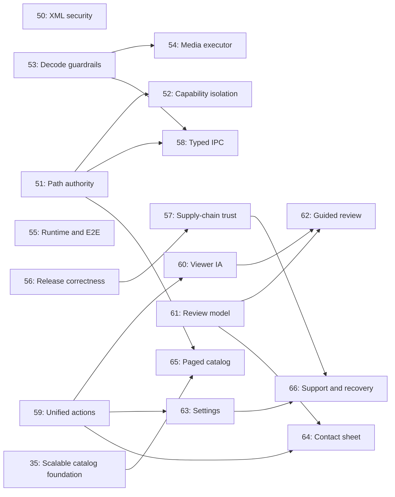

# LightFrame Product, Architecture, Performance, and Security Audit - 2026-07-26

## Purpose

This document turns the 2026-07-26 audit into an executable delivery program. It is the current
source of truth for newly identified product, architecture, performance, maintainability, release,
and security work.

Every linked task is written so that an implementation agent can:

1. confirm that its assumptions still match `main`;
2. create one isolated task worktree with the task file as the recorded specification;
3. implement the change without rediscovering product intent or security boundaries;
4. run explicit automated and manual checks;
5. hand the result to a separate reviewer using the repository state machine; and
6. stop before commit, push, or pull-request creation unless the user has explicitly authorized
   delivery.

The task files are implementation specifications, not proof that the work is already complete.

## Audited Baseline and Evidence

- Repository: LightFrame
- Audited version: `8.7.5`
- Audited commit: `8a3e380`
- Platform emphasis: Windows desktop through Tauri 2
- Product model: local-first, folder-based image viewer and curation tool
- Frontend: React, TypeScript, Zustand, Vite, Vitest
- Native layer: Rust and Tauri
- Existing quality gates inspected: frontend CI, Rust CI, broad local CI, release workflows, version
  synchronization, Rust advisory handling, and task orchestration
- Runtime review: primary viewer, contact sheet, settings, compare, slideshow/projector, edit queue,
  error states, and browser development entry point
- Code review emphasis: privileged IPC, path authority, decode/edit workloads, native concurrency,
  asset serving, window capabilities, release integrity, component boundaries, and large-folder data
  flow

The audit is a repository and runtime design review, not a formal penetration test. Any task that
changes an exposed trust boundary must include adversarial tests and an independent security-minded
review.

## Executive Assessment

LightFrame has a broad and coherent feature set, a strong local-first position, and unusually good
automated coverage for a desktop image viewer. The next material improvement is not adding more
isolated toolbar commands. It is making the product easier to understand as a review workspace and
making the native boundary safe and predictable under hostile or unusually large input.

The roadmap therefore has four connected themes:

1. **Establish native trust boundaries.** Eliminate the known vulnerable XML dependency, move
   filesystem authority to Rust, isolate windows and assets, and enforce decode/edit budgets.
2. **Bound and type the platform.** Introduce controlled media scheduling, verifiable IPC contracts,
   reliable browser/Tauri integration tests, and correct release gates.
3. **Create a legible review product.** Consolidate duplicated commands, organize the viewer into
   explicit work modes, add a durable Pick/Reject model, and build a guided review loop.
4. **Scale without losing user trust.** Page very large folder catalogs, improve support and crash
   recovery, redact diagnostics, and make Windows release provenance visible.

## Principal Findings

### Security and data safety

- The resolved Rust graph includes `quick-xml 0.37.5`, while the advisory workflow suppresses the
  related RustSec findings. Edited files can preserve metadata, so malicious metadata is part of
  the application's input surface.
- Privileged commands accept WebView-supplied filesystem paths. A compromised renderer should not
  be able to turn arbitrary strings into native read, write, move, delete, edit, or external-process
  authority.
- The asset protocol has a broad filesystem scope and the projector window does not have a sharply
  distinct least-privilege capability set.
- Decode and edit limits are not expressed as one native resource policy applied to every entry
  point. Frontend validation cannot be the security boundary.
- Release workflows need immutable action pinning, same-commit gate enforcement, reproducible
  version metadata, verifiable checksums/provenance, and an explicit Windows code-signing strategy.

### Performance and scalability

- Independent blocking image jobs can compete for CPU and memory without one global concurrency,
  priority, cancellation, or deduplication policy.
- Large-folder improvements exist in the roadmap, but the final Rust-to-WebView model still needs a
  paged catalog contract so folder size does not imply one monolithic IPC payload.
- Performance work needs observable queue depth, cancellation, resource rejection, and latency
  signals so regressions can be diagnosed rather than guessed.

### Maintainability and correctness

- The native command surface and its TypeScript facade are large enough that domain boundaries and
  cross-language contract drift are material risks.
- Viewer actions are represented in several UI surfaces, increasing the chance of inconsistent
  visibility, enablement, shortcuts, labels, and analytics.
- `ViewerChrome` and Settings carry too many unrelated responsibilities, making product iteration
  riskier than necessary.
- Browser development currently reaches Tauri-only behavior too early. A browser-safe runtime
  boundary and a small real-shell E2E suite would catch different classes of failure.

### Product design and accessibility

- LightFrame exposes substantial capability, but the primary hierarchy is command-centric rather
  than task-centric. View, Grid, Compare, and Present should read as deliberate work modes.
- The product has favorites and ratings, but no explicit, resumable review decision model. A
  Pick/Reject/Unreviewed loop is the clearest high-value workflow extension.
- Contact-sheet controls should support both visual scanning and bulk review without crowding the
  canvas.
- Settings need navigation, search, predictable focus management, and an integrated Support area.
- Diagnostics, updates, crash recovery, and interrupted edits should be presented as one user-trust
  system, with personal path data redacted by default.

## Implementation Task Index

| Task | Priority | Outcome | Dependencies |
| --- | --- | --- | --- |
| [50 - Remove Vulnerable quick-xml](tasks/50-remove-vulnerable-quick-xml.md) | P0 | Remove the vulnerable XML parser path and advisory suppressions while preserving metadata workflows safely. | None |
| [51 - Folder Session Path Authority](tasks/51-folder-session-path-authority.md) | P0 | Replace arbitrary path-bearing privileged IPC with backend-owned sessions and opaque resource grants. | None |
| [52 - Tauri Capability and Asset Isolation](tasks/52-tauri-capability-and-asset-isolation.md) | P0 | Give main and projector windows explicit least-privilege capabilities and remove global asset access. | 51 |
| [53 - Native Decode and Edit Guardrails](tasks/53-native-decode-and-edit-guardrails.md) | P0 | Apply one native resource policy to all image decode and edit entry points. | None |
| [54 - Bounded Native Media Executor](tasks/54-bounded-native-media-executor.md) | P1 | Bound concurrency, prioritize interaction, deduplicate work, and make cancellation meaningful. | 53 |
| [55 - Browser-Compatible Runtime and Tauri E2E](tasks/55-browser-compatible-runtime-boundary-and-e2e.md) | P1 | Keep browser development usable while adding authoritative Windows-shell integration coverage. | None |
| [56 - Version and Release Gate Correctness](tasks/56-version-lock-and-release-gate-correctness.md) | P1 | Synchronize every version source and require the exact release commit to pass all gates. | None |
| [57 - Release Supply Chain and Windows Trust](tasks/57-release-supply-chain-and-windows-trust.md) | P1 | Pin the release supply chain and publish verifiable Windows artifact identity and provenance. | 56 |
| [58 - Typed IPC and Rust Domain Modules](tasks/58-typed-ipc-and-rust-domain-modules.md) | P1 | Stabilize cross-language contracts and split native commands into owned domains. | 51, 53 |
| [59 - Unified Actions and Viewer Decomposition](tasks/59-unified-action-model-and-viewer-decomposition.md) | P1 | Make action behavior consistent across surfaces and create safe frontend component seams. | None |
| [60 - Viewer Workspace Information Architecture](tasks/60-viewer-workspace-information-architecture.md) | P1 | Reframe the viewer around View, Grid, Compare, and Present modes with less duplicated chrome. | 59 |
| [61 - Review Session Curation Model](tasks/61-review-session-curation-model.md) | P1 | Persist Unreviewed, Pick, and Reject decisions plus resumable review progress. | None |
| [62 - Guided Review Session](tasks/62-guided-review-session-workflow.md) | P1 | Deliver the flagship fast, resumable Pick/Reject workflow with undo and completion. | 60, 61 |
| [63 - Settings IA and Accessibility](tasks/63-settings-information-architecture-and-accessibility.md) | P1 | Make Settings navigable, searchable, keyboard-safe, and easier to maintain. | 59 recommended |
| [64 - Contact Sheet Density and Bulk Review](tasks/64-contact-sheet-density-and-bulk-review.md) | P1 | Improve scanning density and consolidate selection into a sticky bulk-action workflow. | 59; 61 for Pick/Reject |
| [65 - Paged Folder Catalog](tasks/65-paged-folder-catalog.md) | P2 | Incrementally hydrate very large folders without monolithic native-to-WebView payloads. | 35, 51 |
| [66 - Support, Privacy, Updates, and Recovery](tasks/66-support-privacy-update-and-crash-recovery.md) | P2 | Redact support data, expose update trust, and recover safely from crashes or interrupted edits. | 63, 57 |

Task 52 supersedes the still-unimplemented capability and scope portions of historical task 40.
Keep task 40 as design history; do not implement both specifications independently.

## Dependency Map



Nodes without an incoming edge can be scheduled independently, but every task still gets its own
worktree, implementation cycle, final gate, and independent review.

## Recommended Execution Program

Use dependency readiness and risk reduction, not task number alone, when selecting work.

### Phase A - Remove critical native risk

1. Task 50: remove the known vulnerable dependency and its suppressions.
2. Task 53: establish one enforceable native decode/edit budget.
3. Task 51: move filesystem authority behind opaque Rust-owned sessions.
4. Task 52: narrow window capabilities and asset access after task 51 is merged.

Task 50 and task 53 do not depend on one another. Task 51 may also proceed separately, but running
these as distinct changes makes review and rollback clearer.

### Phase B - Make the platform bounded and verifiable

5. Task 56: repair version synchronization and same-commit release gates.
6. Task 55: create the browser-safe boundary and real-shell E2E harness.
7. Task 54: put expensive native work behind the bounded executor.
8. Task 58: split and type the stabilized IPC surface.
9. Task 57: add immutable release inputs, checksums, provenance, and Windows trust.

### Phase C - Establish the product architecture

10. Task 59: unify actions and decompose the viewer without changing behavior.
11. Task 60: implement the mode-based viewer hierarchy.
12. Task 61: add the review decision and progress model.
13. Task 62: build the guided Review Session on tasks 60 and 61.
14. Task 63: rebuild Settings navigation and accessibility on the shared action/component patterns.
15. Task 64: improve contact-sheet density and bulk review.

Task 61 can start before task 60 is merged because it deliberately minimizes UI work. Task 62 must
wait for both.

### Phase D - Scale and reinforce user trust

16. Task 65: page the folder catalog after tasks 35 and 51 are complete.
17. Task 66: integrate diagnostics privacy, update trust, crash recovery, and edit recovery after
    tasks 57 and 63.

## Agent Pickup Protocol

For any task in the index:

1. Read the entire task file, `AGENTS.md`, `.agent/ANTIGRAVITY.md`, the applicable repository skill,
   and all orchestration instructions named by `AGENTS.md`.
2. Verify every statement in the task's current-code context against the freshly fetched
   `origin/main`. If a prerequisite is not merged or behavior already exists, stop and report the
   exact mismatch rather than improvising a second implementation.
3. Record the task file as the specification when creating the isolated worktree:

   ```powershell
   node scripts/agent-task.mjs start --slug <task-slug> --title "<task title>" --spec-file <task-file>
   ```

4. Keep the change within the task's goal, required work, constraints, and non-goals. If the diff
   grows into a materially different domain, stop and propose a follow-up task.
5. Implement the specified tests alongside the production change. A passing happy-path test is not
   sufficient for path authority, malicious input, cancellation, persistence migration, release,
   or recovery work.
6. Run the task-specific commands and the required final gate exactly as specified.
7. Hand the result to a separate reviewer. The implementation agent must not approve its own work.
8. Remediate the reviewer's exact checklist, rerun affected checks and the final gate, and request a
   new review. Follow the three-unchanged-cycle stop rule in the repository contract.
9. Do not commit, push, open a pull request, or merge without the explicit authorization required by
   `AGENTS.md`.

## Global Definition of Done

A task is complete only when all of the following are true:

- Every acceptance criterion in the task file is demonstrated by code, tests, or documented manual
  verification.
- No unrelated user work or roadmap task is folded into the change.
- Existing data is migrated or remains readable; partial writes and destructive failure modes are
  tested where applicable.
- New IPC surfaces are typed, validate all untrusted input in Rust, use bounded values, and avoid
  adding new raw-path authority.
- Expensive native work has explicit limits and cannot create unbounded concurrency, queues, memory
  growth, or payload sizes.
- User-facing UI is checked with keyboard-only interaction, visible focus, both supported themes,
  narrow and wide layouts, empty states, loading states, and recoverable error states.
- Accessibility names, roles, state, focus order, and reduced-motion behavior are verified for new
  interactions.
- Security and release changes contain adversarial or negative tests, not only configuration diffs.
- New dependencies are narrowly justified and do not introduce unresolved audit findings.
- Task-specific checks and the specified final gate pass after the final code change.
- A separate reviewer returns the exact `APPROVED` state required by the repository workflow.
- Documentation describes only behavior that is actually shipped by that task.

## Outcome Measures

The program should leave LightFrame with:

- no suppressed known vulnerability in the shipped XML/metadata path;
- no privileged image mutation command whose authority is an arbitrary renderer-provided path;
- explicit, testable capability differences between main and projector windows;
- deterministic rejection of oversized or abusive native media work;
- bounded background media concurrency with observable queue and cancellation behavior;
- one mechanically checked IPC contract across Rust and TypeScript;
- a browser development surface that renders reliably and a Windows E2E smoke path for privileged
  integration;
- releases tied to the exact gated commit with verifiable artifact integrity and provenance;
- a primary interface organized around user work modes rather than duplicated command bars;
- a resumable, keyboard-efficient folder review workflow;
- a settings and support experience that is accessible and privacy-preserving; and
- folder browsing whose IPC and memory cost grows by page, not by the full catalog size.
